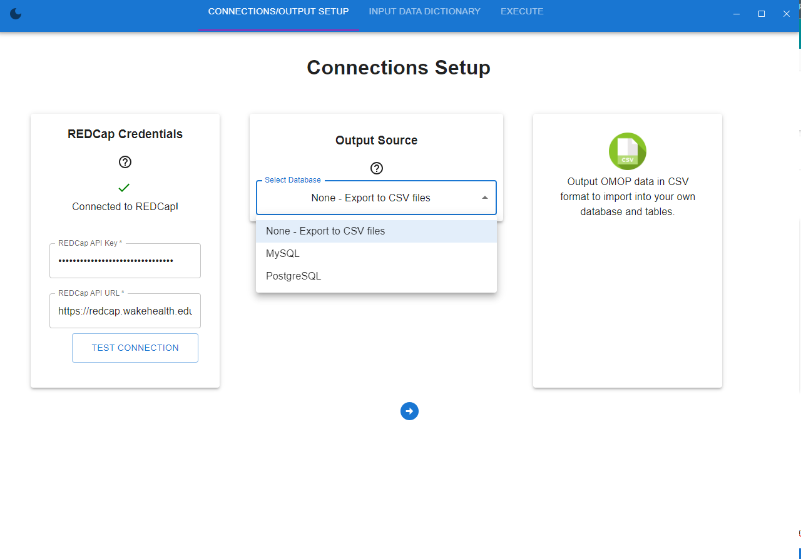
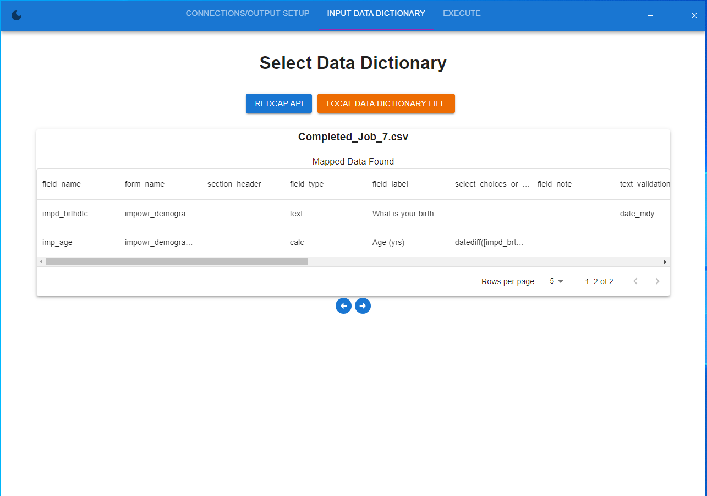
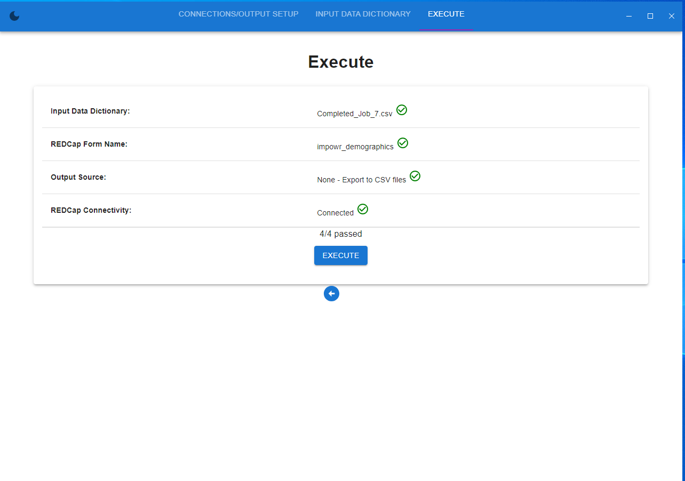
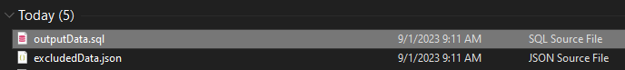

# REDCap Companion Desktop App

This app imports the CSV mapping file that is generated from final step in the CDE to OMOP web app. You need to enter your REDCap API credentials in order to get the records as well as your database credentials to insert the records into the appropriate OMOP tables.

# How to run or build .exe

Clone the repo down and run `npm install`

## To run without building

Execute the command `npm run start` and will attempt to run on http://localhost:3000/

## To Build .exe file

Run `npm run build`

This will create a `build` and `dist` directory. The .exe will be located in the `dist`` directory.

## Getting Started
**Fig.1** - Here is the first screen where you will setup the REDCap connection and how you want the data to be outputted (CSV files or directly into a supported database).

**Fig.2** - Next, you can either pull in the data dictionary from your REDCap API which will look for mappings in the 'field_annotations' column or you can just use a local file that contains this mapping data. These files can be retrieved from the last step of mapping/verifying on the CDE to OMOP web app. In the example below, I am using a local data dictionary file called Completed_Job_7.csv.

**Fig.3** - The last screen ensures everything is prepped and ready to be converted into the OMOP CDM.

**Fig.4** - Since we selected CSV files as the output, you will get these two files. The outputData.sql will contain all the data and insert into the appropriate OMOP CDM tables. The excludedData.json will be any rows or data that has to be discarded because it does not meet the requirements to be inserted into the OMOP CDM.

## Updating Atlas Data

Execute Achilles in R Studio. Change the connectionDetails to work for your instance.

    connectionDetails <- createConnectionDetails(
        dbms = "postgresql", 
        server = "localhost/postgres", 
        user = "postgres", 
        password = "yourpassword"
    ) 
		 

Execute this line for Achilles 1.7.2, fixes conflict with r studio version due to server/hostname issue

    options(connectionObserver = NULL)

Finally execute Achilles. Again, any options below to better suit your instance.

    Achilles::achilles(
        cdmVersion = "5.4", 
        connectionDetails = connectionDetails,
        cdmDatabaseSchema = "cdm_synthea10",
        resultsDatabaseSchema = "results",
        smallCellCount = 0,
        createTable = TRUE,
    )

Next, clear any related rows in the `web_api` schema in the `achilles_cache` table that you are testing for.

Visit the Atlas Data Sources page and refresh and test again.

